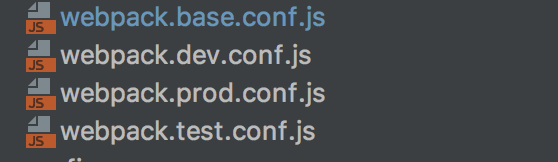

# Webpack

***Webpack***  is an open-source JavaScript module bundler for JavaScript applications. The bundler can be used from the command line(CLI) or configured using a config file named webpack.config.js. It takes modules with dependencies and generating static assets representing those modules.

Nowadays, Webpack is a leading bundler for Angular, React and Vue frameworks with various templates.  Due to it's unique syntax who are new to Webpack thinking that it is difficult to configure and using it. But once you are familiar with it's features then it is very easy to use in all kinds of applications. The current version of webpack is 3.8.1v.

It works with two major goals

* Everything treated as a module which includes JS files, CSS files, image files and HTML files. Also each artifict can be divided into smaller and reusable chunks.
* Load only the modules which you need on demand. Some of the bundlers combines all of the modules into single big bundle.js file which takes more time for initial load.In contrast, Webpack generates several smaller “bundle” files, which loads some parts of the app asynchronously to improve the page load time.


Currently this bundler converts below modules with dependencies to static assets


# Building blocks:

There are four major building blocks of Webpack configuration.

## 1. Entry: 

An entry point is used to indicate which module started to use for building the internal dependency graph. After processing the entry point, it will use modules and libraries which are dependent on entry points(either direct or indirect dependencies). The entry point is configured in webpack configuration file using entry syntax.

### CodeSnippet1:
```
module.exports = {
  entry: './app.js'
};
```
Normally the entry syntax can be defined in two ways(Single entry syntax and Object Syntax).

### Single entry syntax:

The above mentioned syntax(CodeSnippet1) is the the shorthand notation for below syntax. Whenever there is only one entry point then we can defined with shorthand notation.
```
const config = {
  entry: {
    main: './app.js'
  }
};
```
We can also pass an array of file paths knows as multi-main entry as below,
```
module.exports = {
  entry: ['./app1.js','./app2.js',]
 };
 ```
In the above case it creates a bundle named file2 and load file1 after that.

### Object Syntax:

The object syntax is the most scalable approach to define entry points in the application. This approach is used in both single page applications and multi page applications.

In single page applications, we need to have separate bundles for both application code and vendor code as below,
```
const config = {
  entry: {
    app: './app.js',
    vendors: './vendors.js'
  }
};
```

Whereas multi page application, we are going to have multiple HTML documents fetched one page per request by the server, in this case it is recommended to have separate entry for each page
```
const config = {
  entry: {
    pageOne: './index-one.js',
    pageTwo: './index-two.js',
    pageThree: './index-three.js'
  }
};
```
## 2. Output:

The output property is used to tell the user about storage location of generated bundles with customized naming. Normally we use path and filename properties of output emitted files to indicate directory location and file name. Lets store the generated file name in dist folder with prod.config.js file.
```
module.exports = {
  output: {
    path: path.resolve(__dirname, 'dist'),
    filename: 'prod.config.js'
  }
};
```
### Multiple entry points:

If you are dealing with multiple entry points then you can define multiple output bundles in the runtime using substitutions,

The below code snippet writes two files to disk: ./dist/file1.js, ./dist/file2.js,
```
{
  entry: {
    app: './src/file1.js',
    search: './src/file2.js'
  },
  output: {

    filename: '[name].js',
    path: __dirname + '/dist'

  }

}
```

### Public paths with hashes:

There is a possibility to define public paths such as CDN using publicPath and  hashes for assets.
```
output: {
  path: "/home/proj/assets/[hash]",
  publicPath: "http://cdn.example.com/assets/[hash]/"
}
```
The publicPath aware plugins replace the development purpose URLs with Production specific URLs. For example, the logos specific to production clients are replaced in the runtime as below,
```
// Development: Both Server and the image are on localhost
.image {
&nbsp; background-image: url(‘./logo.png’);
}

// Production: Server is on Heroku but the image is on a CDN
.image {
&nbsp; background-image: url(‘https://pathOfCDN/logo.png’);
}
```
If we don't know the public path at compile time, just use __webpack_public_path__ in your entry point file which will be assigned dynamically during the execution of entry points.
```
__webpack_public_path__ = myRuntimePublicPath
```
## 3. Loaders:

Webpack understands only JavaScript.It should able to handle bundling all kinds of files by converting them to valid modules. To achieve this capabilities we need to use various loaders based on file type. First it will identify the file using test property and then apply the loader using use property. The set of these properties categorized as a rule using rules property under module.
```
module.exports = {
module: {
   rules: [
           { test: /\.txt$/, use: 'raw-loader' }
          ]
     }
};
```
By default, all loaders follow the naming convention "xxx-loader". You can define and write your own loaders as well.  The multi loaders chaining works from right-to-left and the loader are separated by “!”. 

Basically we can configure the loaders in 3 different ways,

### 1.Configuration file:  Define the loaders in webpack.config.js as mentioned in the above code snippets.  You can also define multiple loaders using array notation.

 ```
 module: {
    rules: [
      {
        test: /\.css$/,
        use: [
          { loader: 'style-loader' },
          {
            loader: 'css-loader' }
           ]
      }
    ]
  }
  ```
### 2.  Inline mode: Explicitly specify loaders using ES6 import  statement as below,
```
import Styles from 'style-loader!css-loader?modules!./styles.css';
```
### 3. CLI mode: You can supply the loaders on CLI mode as well.
```
webpack --module-bind 'css=style-loader!css-loader'
```
You can define any number of loaders using --module-bind option.

CSS and Babel loaders most commonly used in web applications.

### CSS Loaders:

Let’s say we have a CSS file  called “test.css” and we want to place it's content into <style>test CSS content</style> tag inside our HTML page. We can accomplish that using two loaders: css-loader and style-loader.

### CSS-loader:

If the webpack finds CSS dependency in your module then it handover the file to this loader and it load CSS, dependent CSS files(@import) into JSON file.
Style-loader: Take the JSON file and add it to style tag(<style>test CSS content</style>). After that it inserts inside HTML file.
We can define this in shorthand format as well.
```
module: {
 loaders: [{
  test: /\.css$/,
  loader: ‘style!css’ (short-hand notation for style-loader!css-loader)
 }]
 ```
We can also parameters for loaders. For example, we are configuring url-loader to use DataURLs for images less than 512kb and use URL for images that are larger than 512kb. Either we can append to url-loader after "?" mark or define query object with limit key-value pair.
```
{
    test: /\.png$/
    loader: “url-loader?limit=512”
}
(or)
{
    test: /\.png$/
    loader: “url-loader”
    query: {limit:512}
}
```
### Babel loader:

Normally we see that babel-loader is used to convert ES6 to ES5 code and also  to parse React’s JSX to JS code. We can pass this configuration to query object as below,
```
module: {
  loaders: [
           {
             test: /\.jsx?$/,
             exclude: /(node_modules|bower_components)/,
             loader: 'babel',
             query: {
                   presets: ['react', 'es2015']
              }
          }
       ]
}
```
In many projects, the babel's configuration can become very large and in that case it is preferred to use separate '.babelrc' file. The babel-loader automatically detect's the babel file
```
//webpack.config.js
module: {
   loaders: [
              {
              test: /\.jsx?$/,
              exclude: /(node_modules|bower_components)/,
              loader: 'babel'
              }
    ]
}
//.bablerc
{
  “presets”: [“react”, “es2015”]
}
```
## 4. Plugins:

The plugins provides wider options such as bundle optimization or minification, defining environment variables and customized plugins to perform various tasks with different options. You can create instances of plugins using new operator under plugins section.
```
const HtmlWebpackPlugin = require('html-webpack-plugin'); //installed via npm

const webpack = require('webpack'); //to access built-in plugins
......

plugins: [

       new webpack.optimize.UglifyJsPlugin(),
       new HtmlWebpackPlugin({template: './src/index.html'})

]
```
The plugins are useful for the purpose which can't be done through loaders.

You can use the plugins in two ways

Configuration file: As mentioned in the previous code snippets, define plugins property which takes an array of plugins with new keyword.
Node API:  Access the webpack configuration file and apply the plugin using compiler.apply command. This approach is not recommended compared to configuration file.
```
  const webpack = require('webpack'); //to access webpack runtime
  const configuration = require('./webpack.config.js');

  let compiler = webpack(configuration);
  compiler.apply(new webpack.ProgressPlugin());

  compiler.run(function(err, stats) {
    // ...
  });
  ```
# Development vs Production builds:

Generally you might observed that most of the applications having many webpack configuration files based on environment.



This is because some of the features available in development mode, some other for Production and few of them for both the environments.

Let's compare both dev and prod configurations. The "hot replacement module"(reload the component that has changed),"inline"(live reloading for the entire page) are specific development purpose where as "hide modules" are production specific features.

The package.json has to be defined with scripts section to create bundles for both environments as follows,
```
“scripts”: {
 //npm run build to build production bundles
  “build”: “webpack --config webpack.config.prod.js”, // npm run build

  //npm run dev to generate development bundles and run dev. server
   “dev”: “webpack-dev-server&nbsp --inline --hot” //npm run dev
}
```
Webpack provides two interfaces

### Webpack CLI tool:
This comes by default as part of webpack and no need to install separately. This is recommended for production builds.

### Webpack-dev-server tool : 
An Express nodejs server which runs at port 8080 and you need to install separately. This is for development purpose only to ease live reloading etc features. These features configured through CLI and devServer configuration object in webpack.config.js as well.
```
//Via CLI
webpack-dev-server --hot --inline

//Via webpack.config.js
devServer: {
  inline: true,
  hot:true
}
```
# Summary: 

If you have plans to work with large teams to create web apps  then it is recommended to use Webpack bundler. Even you work on personal projects, you can benefit greatly by its powerful module bundler features. Current trends shows that webpack is a leading bundler compared to other popular bundlers such as browserify, rollup and jspm bundlers.